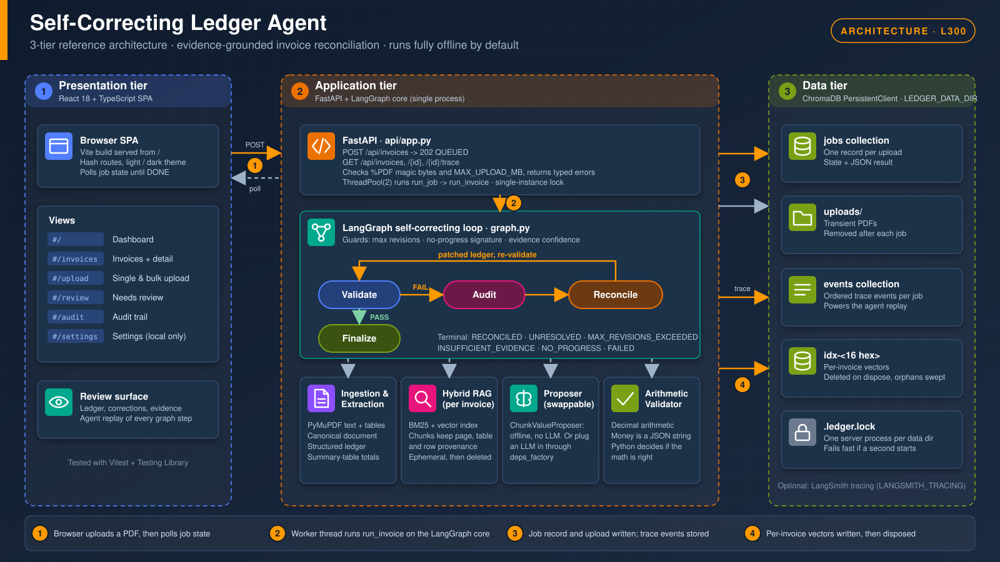

# Self-Correcting Ledger Agent

Document-scoped, evidence-grounded invoice reconciliation. A proposer (an LLM, or the offline `ChunkValueProposer`) suggests evidence-backed corrections; deterministic Python decides whether the arithmetic is right. Upload a PDF in the browser, watch the job run, and read the reconciled ledger, the corrections and the evidence behind each one.

## Architecture




## Quick start (Windows / PowerShell)

```powershell
python -m venv .venv
.venv\Scripts\pip install -e ".[dev]"
cd frontend; npm ci; cd ..
powershell -ExecutionPolicy Bypass -File scripts\serve.ps1   # builds frontend/dist if missing, serves UI + API
# open http://localhost:8787
```

The scripts are unsigned, so under the default Windows PowerShell 5.1 execution policy they must be started with `-ExecutionPolicy Bypass -File ...` as above (or run `Set-ExecutionPolicy -Scope Process Bypass` first). `serve.ps1` stops with a clear message if `npm ci` or `npm run build` fails, and always restores your shell's working directory.

`powershell -ExecutionPolicy Bypass -File scripts\dev.ps1` runs uvicorn with `--reload` plus the Vite dev server on http://localhost:5173 (both as child processes; Ctrl+C or closing either one stops both process trees), which proxies `/api` to `http://localhost:8787` (override with `VITE_API_PROXY`). Port 8787 is used instead of 8000 because 8000 is commonly taken.

No API keys and no network are needed: the default embedder and proposer are offline.

## API

| Method and path | Success | Errors |
|---|---|---|
| `GET /api/health` | `200 {"status":"ok","store":"chroma"}` | |
| `POST /api/invoices` (multipart field `file`) | `202 {"job_id","status":"QUEUED"}` | `422 missing_file` / `invalid_request` (malformed body), `415 not_a_pdf` (no `%PDF` magic; extension is ignored), `413 too_large` (over `MAX_UPLOAD_MB`), `503 unavailable` (could not queue) |
| `GET /api/invoices?limit=50` | `200` list of jobs, newest first (limit clamped to 1..200) | `422 invalid_request` (non-integer `limit`) |
| `GET /api/invoices/{job_id}` | `200` job: `state` (`QUEUED/RUNNING/DONE/ERROR`), `result` (core status, ledger, corrections, evidence), `error` | `404 not_found` |
| `GET /api/invoices/{job_id}/trace` | `200` ordered trace events | `404 not_found` |

Every error body is `{"code": str, "message": str}` (any other HTTP error, such as `405` for a wrong method, is `http_error`). Money is always a JSON string. `ERROR` means a service failure (including "interrupted by restart"); `result.status = FAILED` means the invoice itself could not be processed.

## Data and configuration

All state lives under `LEDGER_DATA_DIR` (default `./data`): `chroma/` (jobs, events, vectors) and `uploads/` (transient PDFs, removed after each job and swept at startup). The server writes `data\.gitignore` containing `*` when it creates the folder (and the eval CLI does the same for its output folder), so runtime data is never committed by accident. `data\.ledger.lock` holds the single-instance lock described under Known limits.

| Variable | Default | Meaning |
|---|---|---|
| `LEDGER_DATA_DIR` | `./data` | Data directory |
| `MAX_UPLOAD_MB` | `20` | Upload size limit |
| `LEDGER_FRONTEND_DIST` | `frontend/dist` | Built UI served at `/` (a warning is logged at startup if the folder is missing) |
| `LEDGER_LOG_LEVEL` | `INFO` | Level of the JSON trace log (`ledger_agent.trace` logger, one JSON line per graph node on stderr) |
| `LANGSMITH_TRACING` / `LANGSMITH_API_KEY` | unset | Optional: set `LANGSMITH_TRACING=true` plus a key to also send LangGraph traces to LangSmith |
| `VITE_API_PROXY` | `http://localhost:8787` | Vite dev-server proxy target |

Jobs left `QUEUED`/`RUNNING` by a crash become `ERROR` ("interrupted by restart") on the next start.

## Frontend

The UI is a React 18 + TypeScript SPA in `frontend/`, using hash routes so the API server can serve it as static files. It has six views:

| Route | View |
|---|---|
| `#/` | Dashboard: summary strip, 14-day activity, status mix, recent activity |
| `#/invoices` | Invoices: status tabs, search, table |
| `#/upload` | Upload: single invoice or bulk (queue, then "Reconcile all") |
| `#/review` | Needs review: invoices the agent stopped on, grouped by stop reason |
| `#/invoices/<id>/document`, `/extracted`, `/reconciliation` | Invoice detail (reconciliation tab has the agent replay) |
| `#/audit` | Audit trail across the most recent invoices |
| `#/settings` | Settings: browser-only preview, stored in `localStorage` and not yet applied by the agent |

Unknown routes show a not-found page. Light, dark and system themes are in the sidebar.

```powershell
cd frontend; npm run dev        # Vite on http://localhost:5173, proxies /api to :8787
```

## Tests

```powershell
.venv\Scripts\python -m pytest        # Python suite
cd frontend; npm test                  # vitest suite
```

## Evaluation

```powershell
$env:PYTHONPATH="src"; .venv\Scripts\python -m ledger_agent.eval --out eval_report
```

Generates a labelled invoice set with known extraction errors and compares four variants (output also written to `eval_report/report.md` and `results.csv`). Real output:

| variant | n | correct | false-correction | reconciled | unresolved | mean iters | max iters | latency ms |
|---|---|---|---|---|---|---|---|---|
| no_rag | 16 | 62% | 38% | 81% | 0% | 1.50 | 3 | 0.3 |
| vector | 16 | 100% | 0% | 81% | 19% | 0.75 | 1 | 27.1 |
| bm25 | 16 | 94% | 0% | 75% | 25% | 0.69 | 1 | 25.9 |
| hybrid | 16 | 94% | 0% | 75% | 25% | 0.69 | 1 | 26.0 |

Retrieval of the source row (line-item cases):

| mode | n | recall@1 | recall@3 | MRR |
|---|---|---|---|---|
| vector | 6 | 100% | 100% | 1.000 |
| bm25 | 6 | 100% | 100% | 1.000 |
| hybrid | 6 | 100% | 100% | 1.000 |

Notes: `no_rag` latency excludes PDF ingestion and indexing (it works on the already-built ledger), so its latency is not comparable with the other rows. The `vector` variant uses the offline `HashingEmbedder` (lexical hashing, not semantic) with the in-memory numpy index, not the Chroma backend, so "vector 100%" is not a claim about semantic RAG.

`no_rag` is an arithmetic-trust baseline (no LLM, no retrieval): a stand-in for 'an LLM without retrieval'. Swap a real LLM client in later.

## Known limits

- Defaults are offline: `HashingEmbedder` (not semantic) and `ChunkValueProposer` (reads the retrieved chunk, no LLM). The swap points are in `deps_factory` in `src/ledger_agent/api/main.py`.
- Jobs run on a thread pool of 2 inside one process; there is no external queue or multi-worker coordination.
- The eval's `no_rag` variant is an arithmetic-trust stand-in for an LLM without retrieval, not a real LLM.
- `hybrid` and `bm25` abstain on the `shipping` eval case: `ChunkValueProposer` maps retrieval rank >= 3 to confidence 0.80, below the 0.90 threshold. That is a safe abstention and a cycle-3 candidate.
- Real scanned-PDF OCR and Docling are interfaces only; scanned pages without an OCR backend end in `FAILED`.
- One server process per data directory: `build_app` takes an exclusive lock on `LEDGER_DATA_DIR/.ledger.lock` before any startup sweep, and a second process on the same directory fails fast with "another ledger-agent process is using ..." instead of destroying the first one's in-flight work.
- A chunked upload without a `Content-Length` header bypasses the early 413 (Starlette spools it to disk before the bounded read); the early reject only covers declared sizes.
- The 20 MB client-side limit in the UI is a constant and is not read from the server's `MAX_UPLOAD_MB`.
- `ChromaJobStore.list` is unbounded and there is no job pruning; the upload handler does synchronous file I/O on the event loop. Both are accepted for now.

## Using the core loop from Python

```bash
pip install -e ".[dev]"   # dev extra includes pytest and reportlab (used to render test invoices)
pytest
```

```python
from decimal import Decimal
from ledger_agent.agents.audit import ChunkValueProposer
from ledger_agent.fakes import HashingEmbedder
from ledger_agent.graph import Deps, run_invoice
from ledger_agent.testing.corrupt import corrupting_builder
from ledger_agent.testing.invoices import default_spec, render_invoice

pdf = render_invoice(default_spec(), "INV-001.pdf")
# Simulate an extraction error: line_01 amount read as 1040.00 instead of 1014.00
deps = Deps(embedder=HashingEmbedder(), proposer=ChunkValueProposer(),
            ledger_builder=corrupting_builder("items[line_01].amount", Decimal("1040.00")))
res = run_invoice(str(pdf), deps)
print(res.status.value, "after", res.iterations, "revision(s)")
for c in res.corrections:
    print(f"{c.field}: {c.old_value} -> {c.new_value} (page {c.source_page}, row {c.source_row}, conf {c.confidence:.2f})")
```

Output (the first line is a PyMuPDF layout notice printed to stderr on import/first use; it is harmless):

```text
Consider using the pymupdf_layout package for a greatly improved page layout analysis.
RECONCILED after 1 revision(s)
items[line_01].amount: 1040.00 -> 1014.00 (page 1, row 1, conf 0.97)
```

Omit `ledger_builder` to run the real PDF extractor (`build_ledger`).

## Core loop internals

```text
Incoming PDF -> Ingestion -> Text + Table Extraction -> Canonical Document
                                   |-- Structured Ledger
                                   +-- Ephemeral hybrid RAG index (BM25 + vectors, per invoice)

LangGraph:  Validate --PASS--> Finalize
               ^
               +--FAIL--> Audit -> Reconcile --> back to Validate
```

Guards (max revisions, no-progress signature, evidence confidence) bound the loop. Every correction is stored as a revision with page/table/row provenance; the original ledger is preserved.

## Terminal statuses

`RECONCILED`, `UNRESOLVED` (the evidence agrees with the extracted values, or a patch was rejected: needs human review), `MAX_REVISIONS_EXCEEDED`, `INSUFFICIENT_EVIDENCE`, `NO_PROGRESS`, and `FAILED` (e.g. scanned PDF with no OCR backend, or no line-item table).

See `memory-bank/progress.md` for the Definition-of-Done audit and `docs/superpowers/` for the spec and plan.
